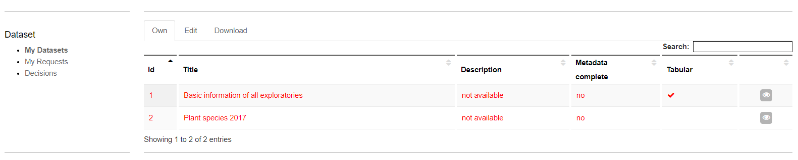

# BEXIS 2.13 - Search UI, Data Discovery Module

# 1 Search UI
Search UI contains some parts to make search easier. In this way, you are able to look for all details of datasets, but not for the uploaded data. You can control the search UI via search manager explained in section 3.

## 1.1	Categories 
Categories are defined by number 1 in the image above. The main nodes like “Project Name” are based on nodes in the metadata. The elements are values in the metadata from a main node and can be used to restrict the current selection. The numbers next to the elements and main nodes show the number of existing data sets in the database. This list changes according to the current selection. After selection the results and the facets updated. With the “more” button it is possible to select more than one element at the same time.

## 1.2	Properties 
Number 2 in the image above is related with properties. In this section there are predefined UI Components like dropdown, radio button or slider to filter the data. There is only one possible choice for every component. After selection the results and the facets are updated accordingly. 

## 1.3	Free text search with Autocomplete
The free text search, number 3 in the image above, works as in any common search engine. It includes Autocomplete where words or phrases are being predicted once three letters or figures are entered. It supports also different languages.

## 1.4	Selected Filter
You can find selected filter part by number 4 in the image above. Every filter applied from section 1.1-1.3 is displayed here. Filters can be deselected just by clicking on it. In point 1 by the categories you are able to select more than one option to a category. If there are more than 2 you will see only the category. Click on the category and a window will open to define your selection for this category.

## 1.5	Results
The matching results are displayed in a table or in the list view. It marks by number 5 in the image above. Basic functions like sorting, filtering, paging are available in the table header. By right clicking on the header, you can change visibility of columns.
The details button opens the detailed view of the selected dataset.

# 2 Data Details
About each dataset created in the BEXIS 2, you can find a detail contains Meta Data, Primary Data, Data Structure, Dataset Permissions, Publish and Attachments explain later.

## 2.1	Meta Data
On this tab you have access to the Meta data of the selected datasets. You are able edit this dataset or make a copy of that.

## 2.2	Primary Data
On this tab you have access to the primary data of the selected dataset. A User can download selected data in an Excel file, comma separated in a CSV file, or tab separated in a TXT or TSV file. Also a user can filter and sort the data before and download only a subset of the dataset. For filtering  use the funnel button next to the variable.

## 2.3	Data Structure
On this tab you have access to the data structure of the selected datasets.

## 2.4	Dataset Permissions
On this tab you have access to the Dataset Permissions Manager.

## 2.5	Publish a Dataset Version
On this tab you are able to publish the latest version of your dataset. In this Version a Zip file will be generated and prepared for download for a specific defined datacenter. More information can be found in the data dissemination manual.

## 2.6	Attachments
On this tab the user with the upload rights is able to manage the attachments for the dataset.  Other users can only see or download the attachments.

# 3	Search Manager
With the help of the search manager, you can make search UI more operative. This part is available from **Setup > Manage search**. 
You need to click on the Refresh Search button, to make the search result effective.

To add a new search component, click on the Create Search Attribute button. The configuration files consist of one element – the field element, and several attributes. The element represent each lucene field and its attribute are used to configure indexing, searching, and display. Take mouse over each question mark near by a field and you can see the help information.

You can use the buttons for edit and delete a search component. 

We, therefore, go through each of the elements attributes of the configuration file.

**Display Name:** This is the name which is displayed in the search UI for the field.

**Source Name:** This is the name of the field in the lucene index.

**Metadata Node:**  Add one or more xpaths from the metadata elements to be mapped against the lucene field.

**Header Item:** 	Tick if this item should be available as a category (e.g. as a grid column).

**Default Header Item:** The header item is be visible upon page load.

**Search Component Type:** This specifies the search pattern that will be should be used against this field (as discussed in the introduction). 
Therefore, the value of this attribute can be any of “Category” for creating a category-based search field, “Facet” for creating faceted search field, “Property” for creating a property search field, and “General” which creates an indexed field which is not displayed in the UI, but however, searched.

**Data Type:** This specifies the primitive data type of the value to be indexed. E.g. string, integer, double, date.

**Store:** This specifies if the field value should be stored. If the field is not stored, you can only search against the terms in the field, however, you cannot retrieve the value. For minimal display of the search result, it is recommended that some fields be store. This value of the store attribute can be either yes or no.

**Multi Value:** This specifies if there are several values of a metadata element in a given field. E.g. if a dataset can have several owners in a metadata, then, the owners field in the index in this case, will be multi-valued
Analyzed: This specifies if the field should be analyzed or not. Only analyzed field can be searched.

**Norm:** This can have a value of yes or no and it is used to specify if a norm should be created for the field. Norms can be used for similarities search between documents. They can also significantly increase index sizes. So, you must take care to of what field should contain norms 

**Boost:** This specifies the importance or weight of a field relative to others in a search. E.g. you may want the terms in “title” of a document to carry more weight than the content of the “footnotes” while indexing and searching.

**UI Component Type:** Choose a UI component Type according to the number of options (1-3  = item, 3-15 = list, >15= range).

**Selection Type:** Choose a selection type based how many choices should be allowed (single, multiple).

**Direction:** Default sort direction for this item (ascending, descending).

# 4	Dashboard
## 4.1	My Datasets
On this page, users can see which datasets they are accessing and which rights they have on the datasets.

## 4.2	Requests
This page lists all your requests.

 
## 4.3	Decision
The page lists open requests for your datasets. You can accept or decline the request by clicking the buttons on the right.

