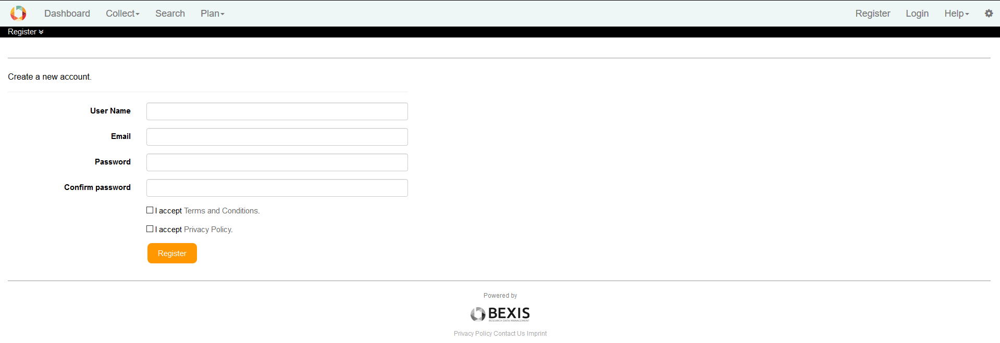
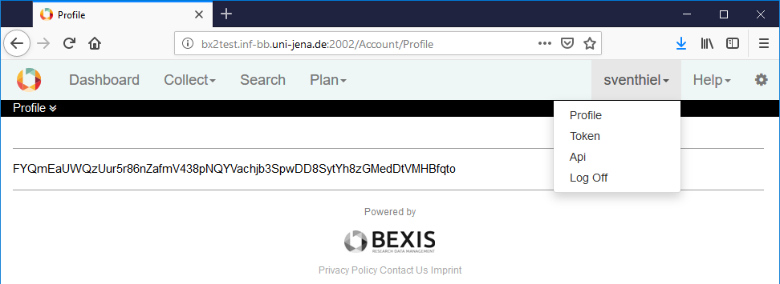
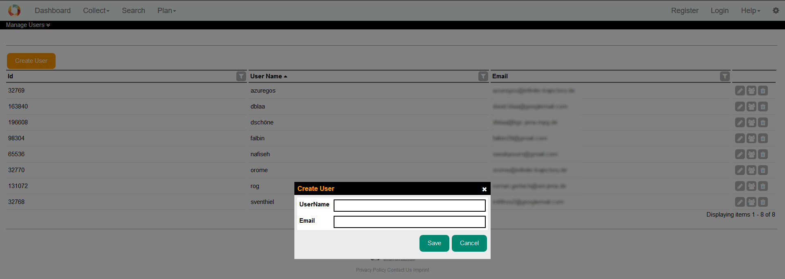
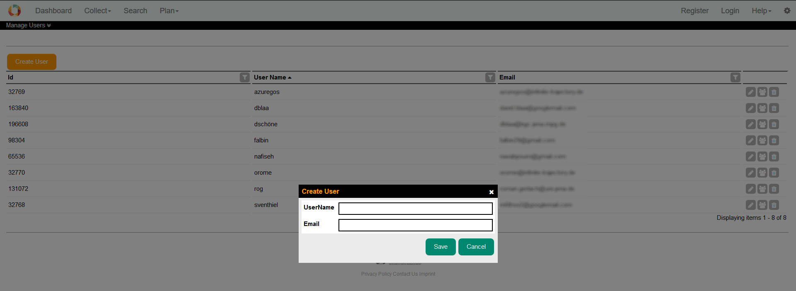
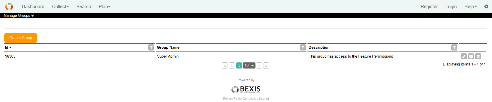
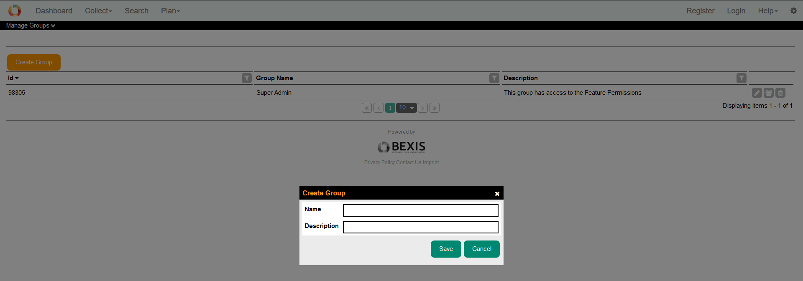
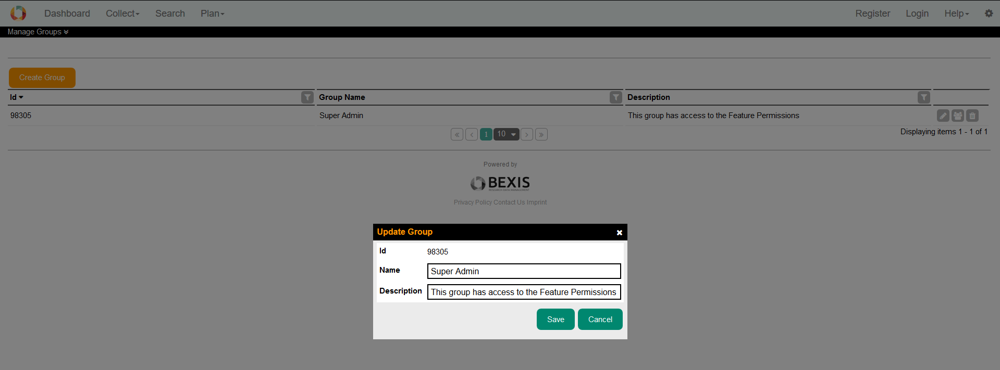

# User and Permission management

<!-- TOC -->
- [A: Overview](#a-overview)

- [B: Manual for users](#b-manual-for-users)

	- [1 Registration](#1-registration)
	- [2 Login](#2-login)
	- [3 Dataset permissions](#3-dataset-permissions)
	- [4 API Token](#4-api-token)
	
- [C: Manual for administrators](#c-manual-for-administrators)
	- [1 Manage User](#1-manage-user)
		- [1.1 Create a user](#11-create-a-user)
		- [1.2 Edit or Delete a user](#12-edit-or-delete-a-user)
	- [2 Manage groups](#2-manage-groups)
		- [2.1. Create a group](#21-create-a-group)
		- [2.2. Edit or Delelte a group](#22-edit-or-delete-a-group)
	- [3 Permission](#3-permission)
		- [3.1. Feature permission](#31-feature-permission)
		- [3.2. Entity permission](#32-entity-permission)
	- [4 Manage datasets](#4-manage-datasets)
	

<!-- /TOC -->

## A: Overview

All features (e.g., search)  and all types of datasets are secured and managed via a user and permission management. Depending on the BEXIS2 configuration, some features (e.g., search) are also accessible for non-registered users, while others only for authorized users. After registration in BEXIS2, the system administrator assigns the appropriate permissions individually or by assigning the user to a permission group. In general, it is possible to add, remove, or modify existing permissions on features and all types of datasets. Each user can also grant permission for their datasets to others. Also, it is possible to generate a personal token for authentication to access BEXIS2 via API.

## B: Manual for users

### 1 Registration

The registration form is accessible via the Register button on the right side. All fields of the form are mandatory and it is required to agree on the *Terms and Conditions* and *Privacy Policy*. Then you are asked to confirm your email address. As the last step, you have to provide some information (e.g.,  name, affiliation to the project, organization). Based on the provided details, the project Team grants permissions within three days.

### 2 Login

Press the *Login* button on the right side. BEXIS2 redirects you to the login form, where you have to enter your account credentials (email or user name and password). If the login is successful, the start page (e.g., *Dashboard* or *Search*) is loaded. Otherwise, you will see information about the status and reason for the failed login.

### 3 Dataset permissions

### 4 API Token

In general, two mechanisms, authentication, and authorization protect the APIs of BEXIS2. Unlike logon, which uses the usual credentials, the APIs use a personalized token for authentication. The token can be found in the user menu. 

 

## C: Manual for administrators
### 1 Manage User

User accounts are used to assign permissions and track actions like the creation of a dataset. Accounts can be linked to the party module and the real user name is shown instead of the account name. 

#### 1.1. Create a user

In addition to the self-registration procedure, the administrator can also create accounts. This feature is available here: *Settings > Manage Users > Create User*. The system supports you with validation on all entered information.

#### 1.2. Edit or Delete a user

Under *Settings > Manage Users* it is possible to view, modify, and delete user information using the following options:

| Button | Description 
|-|-
| Edit | for security and usability reasons, not all fields can be modified (e.g., user name).  
| Group | show the membership in a group   status can be changed by (un)selecting the corresponding checkbox 
| Delete | delete a user account (exception: user accounts already used)

## 2 Manage groups

Groups combine a set of permissions for its members. Users can be assigned to different groups.

 

#### 2.1. Create a group

This feature is available under *Settings > Manage Groups > Create Group*. A new group can be defined.

 

#### 2.2. Edit or Delete a group

Under *Settings > Mange Groups* it is possible to view and modify group information. 

| Button | Description 
|-|-
| Edit | change group name or description 
| Group | members of a group can be (un)selected
| Delete | delete a group (exception: Groups already used)

 

### 3 Permission

Permissions contain specific security regulations. The security system of BEXIS2 distinguishes between two types of permissions. The *feature permission* allows or prohibits access to a well-defined and delimited area of the application, so-called Features. The *data permission* provides the option to protect all types of datasets.

#### 3.1 Feature permission

Under *Settings > Manage Feature Permissions* you can customize features permissions. 

Selecting a checkbox in the navigation tree (e.g., *Search*) will make that feature accessible without authentication (*public access*). **Please use it with care!**

Clicking on a feature name opens a table on the right side. This table contains all subjects (users and groups) and their feature permission status. You may grant or deny permissions for individual users or groups using the radio buttons. If permission is not explicitly set (*none*), it can be inherited from up-level features. Inherited permissions are shown in the first column as *effective* permissions.

 

#### 3.2 Entity Permission

To manage access to entities (datasets and publications) go to *Settings > Manage Entity Permissions*.

By selecting a dataset (by clicking on the row of the dataset), a new table displays all subjects (users and groups) and their different data permission statuses regarding the selected dataset. Here you can also change permissions for the selected dataset.

Selecting the checkbox in the first column (*IsPublic*) gives public access to that dataset without any authentication.

 

In general, BEXIS2 distinguishes different data permission types:

* Read: allows to read & download to primary data and attachments
* Update: enables changes (upload and update) of primary data and metadata
* Delete: allows to delete the whole dataset
* Grant: allows to give permission to other users or groups

### 4 Manage datasets

Display the list of datasets under *Settings > Manage Datasets*. In this list, you can see the status of each dataset and do some useful actions to maintain datasets.

There are two ways to delete a dataset (1) *delete* and (2) *purge*. 

 

There are two ways to delete a dataset:

*Delete* tags a data record to exclude it from nearly all features of BEXIS2 (e.g., search). But you are still able to restore the data record – if needed. 

*Purge* deletes a dataset completely. The data record **can not be restored**. 

[Go to top](#a-overview)
